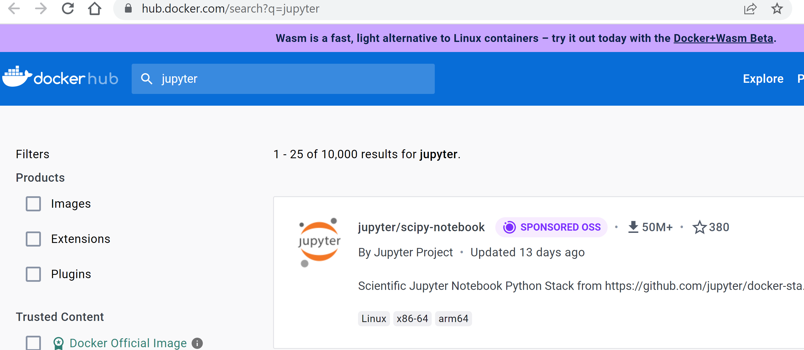
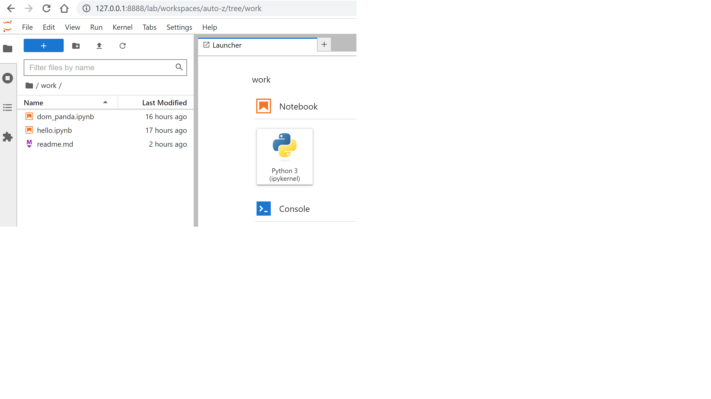
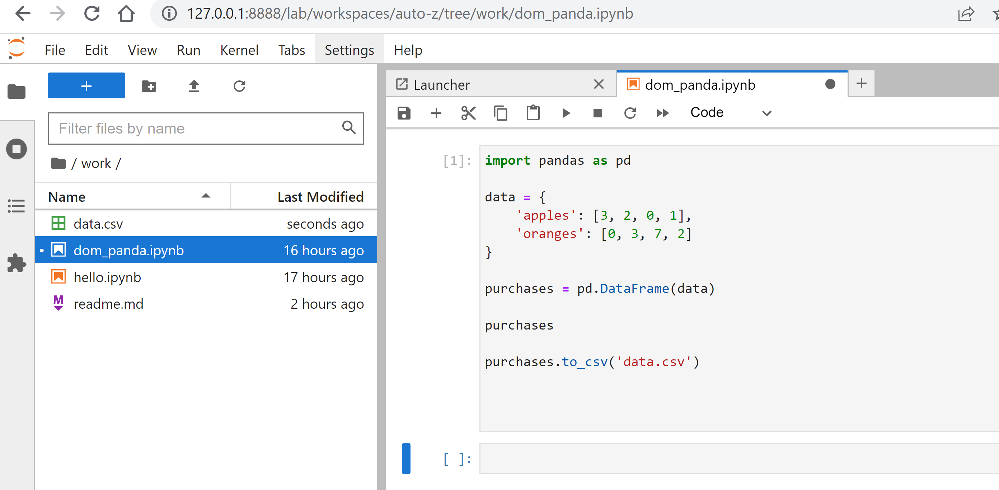
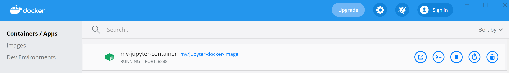
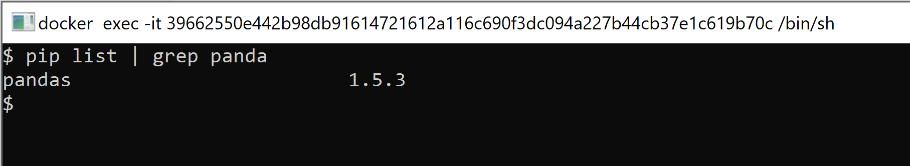
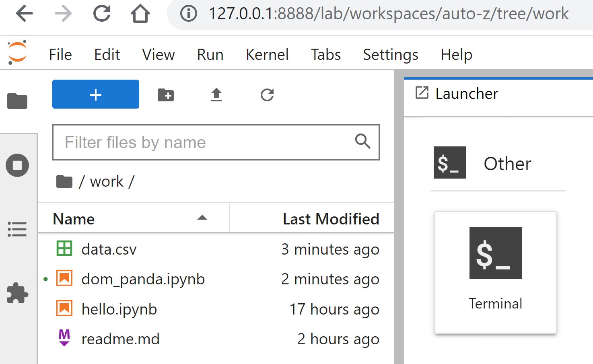
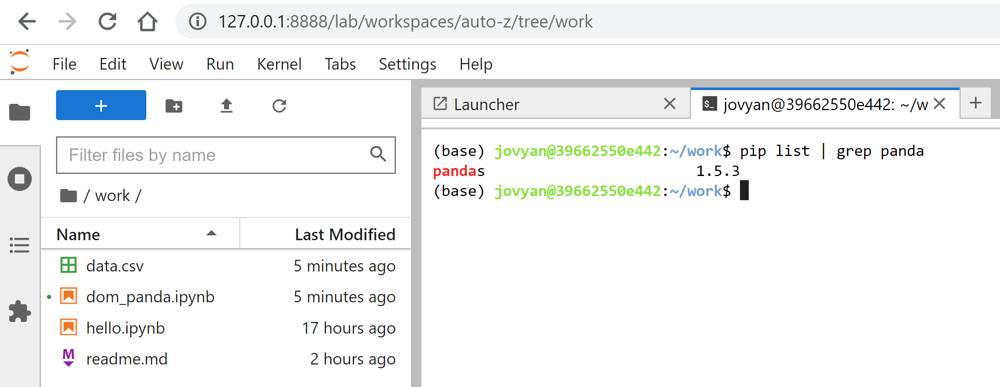

# jupyter-docker

This project demonstrates how to get [Jupyter Notebooks](https://jupyter.org/) running in a [Docker](https://www.docker.com/) container.

I followed this tutorial: [How to Run Jupyter Notebook on Docker - No more Python env and package update](https://towardsdatascience.com/how-to-run-jupyter-notebook-on-docker-7c9748ed209f).


## Does Docker limit the memory that Jupyter can use while running in a container?

According to [Docker: Runtime options with Memory, CPUs, and GPUs](https://docs.docker.com/config/containers/resource_constraints/),
Docker gives the container full access to the host machine's resources.

```txt
By default, a container has no resource constraints and can use as much of a given resource as the host’s kernel scheduler allows.
Docker provides ways to control how much memory, or CPU a container can use, setting runtime configuration flags of the "docker run" command.
```


## Pre-requisites

### Installing Docker Desktop

Follow this guide for installing [Docker Desktop](https://www.docker.com/products/docker-desktop/)

### Git Bash

If you already have [Git](https://gitforwindows.org/) installed on your Windows computer, you
should already have `Git Bash` ...which allows you to have a linux-like terminal window available
to you for running commands in a terminal.

If you are on a Mac or Linux computer, you don't need to worry about Git Bash, as the commands
in a terminal window will be linux commands.

## Finding a Jupyter Docker image on DockerHub

When working with docker, you work with images and containers.

You can create a container based on an image.

In our case, we want to create a container that is based on a jupyter image.

This [query on DockerHub](https://hub.docker.com/search?q=jupyter) searches for `Jupyter`.

You can see there are various images.



I will be using `jupyter/minimal-notebook`, as the tutorial article mentions.

## Building your own image by extending an existing image

The tutorial article starts off with a pure `jupyter/minimal-notebook` image, and then later
demonstrates how to build his own image with a few extra python packages and utilites.

We will go directly to building our own image.

The `Dockerfile` in this repo contains the steps for building our own image.
It starts by using `jupyter/minimal-notebook` as a base image, and then adding these other
utilities: `pandas numpy matplotlib plotly` via `pip install`.

```Dockerfile
ARG BASE_CONTAINER=jupyter/minimal-notebook
FROM $BASE_CONTAINER
LABEL author="WhoAreYou"
USER root
RUN pip install pandas numpy matplotlib plotly
# Switch back to jovyan to avoid accidental container runs as root
USER $NB_UID
```

Open a terminal to the main directory of this github repo (where Dockerfile is located):

Run the command

```sh
docker build -t my/jupyter-docker-image .
```

You should see output similar to this:

```sh
[+] Building 0.1s (6/6) FINISHED
 => [internal] load build definition from Dockerfile                                                                         0.0s 
 => => transferring dockerfile: 32B                                                                                          0.0s 
 => [internal] load .dockerignore                                                                                            0.0s 
 => => transferring context: 47B                                                                                             0.0s 
 => [internal] load metadata for docker.io/jupyter/minimal-notebook:latest                                                   0.0s 
 => [1/2] FROM docker.io/jupyter/minimal-notebook                                                                            0.0s 
 => CACHED [2/2] RUN pip install pandas numpy matplotlib plotly                                                              0.0s 
 => exporting to image                                                                                                       0.0s 
 => => exporting layers                                                                                                      0.0s 
 => => writing image sha256:d1868e6327387ffa2ed0eb9803a687310099c0b3e6f834dcf57db40afd52c237                                 0.0s 
 => => naming to docker.io/my/jupyter-docker-image                                                                           0.0s 
Use 'docker scan' to run Snyk tests against images to find vulnerabilities and learn how to fix them
```

To see the image you just built, type this command

```sh
docker images | grep my
```

You should see this output:

```sh
my/jupyter-docker-image              latest                                                  d1868e632738   1 minute ago    1.75GB
```

You are now ready to create a container off of this image.


## Running the container


NOTE: Always close an existing Jupyter Web IDE browser tab `before` running this command. It limits the error messages you see, and makes it easier to view the http url it will present to you in the terminal.

Open a terminal to the main directory of this github repo.

Run this command:

```sh
MSYS_NO_PATHCONV=1 docker run --rm --name my-jupyter-container -p 8888:8888 -v $(PWD)/work:/home/jovyan/work my/jupyter-docker-image
```

Explanation of the 'docker run' command parameters:

- `--rm` asks docker to remove the container after the container is stopped (very useful)
- `--name my-jupyter-container` asks docker to give the container a name you specify, instead of a randomly generated one
- `-p 8888:8888` asks docker to map port 8888 of your computer to port 8888 of the container
- `-v $PWD/work:/home/jovyan/work` asks docker to map your present working directory's `work` folder (via $PWD/work) to a directory named `/home/jovyan/work` inside the jupyter container. (Apparently this user is baked into the Jupyter image. Search on google for the reason.)
- `my/jupyter-docker-image` asks docker to create the container from the docker image you just built beforehand
- `MSYS_NO_PATHCONV=1` There is a `Window 10 bug in Git Bash` which messes up `volume paths` mapped to docker containers mentioned in
https://github.com/docker-archive/toolbox/issues/673 and https://stackoverflow.com/questions/41485217/mount-current-directory-as-a-volume-in-docker-on-windows-10, and placing `MSYS_NO_PATHCONV=1` before the `docker run`
command fixes the problem.


Alternatively, you can also avoid using "$(PWD)/work", and use the absolute path of your directory surrounded by double quotes.
(Be sure to stop a running container before using `docker run`...this is shown later)

```sh
docker run --rm --name my-jupyter-container -p 8888:8888 -v "C:\Users\yourUserName\Documents\jupyter\work":/home/jovyan/work my/jupyter-docker-image
```

The `docker run` above should produce output like this:

```sh
Entered start.sh with args: jupyter lab
Executing the command: jupyter lab
[I 2023-02-11 17:28:46.061 ServerApp] Package jupyterlab took 0.0000s to import
[I 2023-02-11 17:28:46.065 ServerApp] Package jupyter_server_fileid took 0.0036s to import
[I 2023-02-11 17:28:46.078 ServerApp] Package jupyter_server_terminals took 0.0121s to import
[I 2023-02-11 17:28:46.164 ServerApp] Package jupyter_server_ydoc took 0.0857s to import
[I 2023-02-11 17:28:46.165 ServerApp] Package nbclassic took 0.0000s to import
[W 2023-02-11 17:28:46.169 ServerApp] A `_jupyter_server_extension_points` function was not found in nbclassic. Instead, a `_jupyter_server_extension_paths` function was found and will be used for now. This function name will be deprecated in future releases of Jupyter Server.     
[I 2023-02-11 17:28:46.169 ServerApp] Package notebook_shim took 0.0000s to import
[W 2023-02-11 17:28:46.170 ServerApp] A `_jupyter_server_extension_points` function was not found in notebook_shim. Instead, a `_jupyter_server_extension_paths` function was found and will be used for now. This function name will be deprecated in future releases of Jupyter Server. 
[I 2023-02-11 17:28:46.175 ServerApp] jupyter_server_fileid | extension was successfully linked.
[I 2023-02-11 17:28:46.180 ServerApp] jupyter_server_terminals | extension was successfully linked.
[I 2023-02-11 17:28:46.184 ServerApp] jupyter_server_ydoc | extension was successfully linked.
[I 2023-02-11 17:28:46.191 ServerApp] jupyterlab | extension was successfully linked.
[W 2023-02-11 17:28:46.195 NotebookApp] 'ip' has moved from NotebookApp to ServerApp. This config will be passed to ServerApp. Be sure to update your config before our next release.
[W 2023-02-11 17:28:46.195 NotebookApp] 'ip' has moved from NotebookApp to ServerApp. This config will be passed to ServerApp. Be sure to update your config before our next release.
[I 2023-02-11 17:28:46.199 ServerApp] nbclassic | extension was successfully linked.
[I 2023-02-11 17:28:46.201 ServerApp] Writing Jupyter server cookie secret to /home/jovyan/.local/share/jupyter/runtime/jupyter_cookie_secret[I 2023-02-11 17:28:46.512 ServerApp] notebook_shim | extension was successfully linked.
[I 2023-02-11 17:28:46.674 ServerApp] notebook_shim | extension was successfully loaded.
[I 2023-02-11 17:28:46.674 FileIdExtension] Configured File ID manager: ArbitraryFileIdManager
[I 2023-02-11 17:28:46.674 FileIdExtension] ArbitraryFileIdManager : Configured root dir: /home/jovyan
[I 2023-02-11 17:28:46.674 FileIdExtension] ArbitraryFileIdManager : Configured database path: /home/jovyan/.local/share/jupyter/file_id_manager.db
[I 2023-02-11 17:28:46.676 FileIdExtension] ArbitraryFileIdManager : Successfully connected to database file.
[I 2023-02-11 17:28:46.676 FileIdExtension] ArbitraryFileIdManager : Creating File ID tables and indices.
[I 2023-02-11 17:28:46.687 FileIdExtension] Attached event listeners.
[I 2023-02-11 17:28:46.688 ServerApp] jupyter_server_fileid | extension was successfully loaded.
[I 2023-02-11 17:28:46.690 ServerApp] jupyter_server_terminals | extension was successfully loaded.
[I 2023-02-11 17:28:46.690 ServerApp] jupyter_server_ydoc | extension was successfully loaded.
[I 2023-02-11 17:28:46.691 LabApp] JupyterLab extension loaded from /opt/conda/lib/python3.10/site-packages/jupyterlab
[I 2023-02-11 17:28:46.691 LabApp] JupyterLab application directory is /opt/conda/share/jupyter/lab
[I 2023-02-11 17:28:46.695 ServerApp] jupyterlab | extension was successfully loaded.
[I 2023-02-11 17:28:46.701 ServerApp] nbclassic | extension was successfully loaded.
[I 2023-02-11 17:28:46.702 ServerApp] Serving notebooks from local directory: /home/jovyan
[I 2023-02-11 17:28:46.703 ServerApp] Jupyter Server 2.2.1 is running at:
[I 2023-02-11 17:28:46.703 ServerApp] http://9b9ee513c2e1:8888/lab?token=9780613104b2bf708ee57fe1611aba461840140fb5f76635
[I 2023-02-11 17:28:46.703 ServerApp]     http://127.0.0.1:8888/lab?token=9780613104b2bf708ee57fe1611aba461840140fb5f76635
[I 2023-02-11 17:28:46.703 ServerApp] Use Control-C to stop this server and shut down all kernels (twice to skip confirmation).
[C 2023-02-11 17:28:46.707 ServerApp] 

    To access the server, open this file in a browser:
        file:///home/jovyan/.local/share/jupyter/runtime/jpserver-8-open.html
    Or copy and paste one of these URLs:
        http://9b9ee513c2e1:8888/lab?token=9780613104b2bf708ee57fe1611aba461840140fb5f76635
        http://127.0.0.1:8888/lab?token=9780613104b2bf708ee57fe1611aba461840140fb5f76635
```

The bottom of the output has some urls you need to be aware of.

Copy

`http://127.0.0.1:8888/lab?token=9780613104b2bf708ee57fe1611aba461840140fb5f76635` and 
paste it into your web browser. This will open the Jupyter Web IDE.

This link will be different every time, I believe.

## Jupyter Web UI

Using the link mentioned in the previous section should open up the Web IDE for Jupyter.





Notice the `work` folder in the web UI maps to the `work` folder on your laptop.


## Stopping the container

You can do this in two ways:
- from the Docker Desktop UI
- from a terminal window

### From Docker Desktop

In Docker Desktop, you can stop the container by using the `stop` button




### From a terminal window

List the running containers:

```sh
docker ps
```

You should see your container:

```sh
CONTAINER ID   IMAGE                     COMMAND                  CREATED          STATUS                    PORTS                    NAMES
9b9ee513c2e1   my/jupyter-docker-image   "tini -g -- start-no…"   14 minutes ago   Up 14 minutes (healthy)   0.0.0.0:8888->8888/tcp   my-jupyter-container
```

Stop the container with this command:

```sh
docker stop my-jupyter-container
```

(Using its container id would have also worked)


## Opening a terminal into the Jupyter container to look at stuff

If you need to get into the container, and look around , or execute some commands like (pip list), you
can do that in 3 different ways
- from Docker Desktop
- from the Jupyter web UI
- from a terminal window

### From Docker Desktop

In Docker Desktop, you can open a terminal into the container by using the `CLI` button ( e.g. `>_` )


Here, I have run `pip list` and looked for `panda` once inside the terminal:




### From the Jupyter Web UI

In the Jupyter Web UI, in the Launcher page, click on `Terminal`
open a terminal into the container



Here, I have run `pip list` and looked for `panda` once inside the terminal:




### From a terminal window

On your laptop, run either of these commands

```sh

docker exec -it my-jupyter-container bash

OR

docker exec -it my-jupyter-container sh
```

Here, I have run `pip list` and looked for `panda` once inside the terminal:


### Exiting the terminal

Run the command

```sh
exit
```


## References

- https://jupyter.org/
- https://www.docker.com/
- https://towardsdatascience.com/how-to-run-jupyter-notebook-on-docker-7c9748ed209f
- https://www.docker.com/products/docker-desktop/
- https://gitforwindows.org/
- https://www.codewithjason.com/docker-hello-world-app/
- https://devopscube.com/build-docker-image/
- https://hub.docker.com
- https://github.com/docker-archive/toolbox/issues/673
- https://stackoverflow.com/questions/41485217/mount-current-directory-as-a-volume-in-docker-on-windows-10


